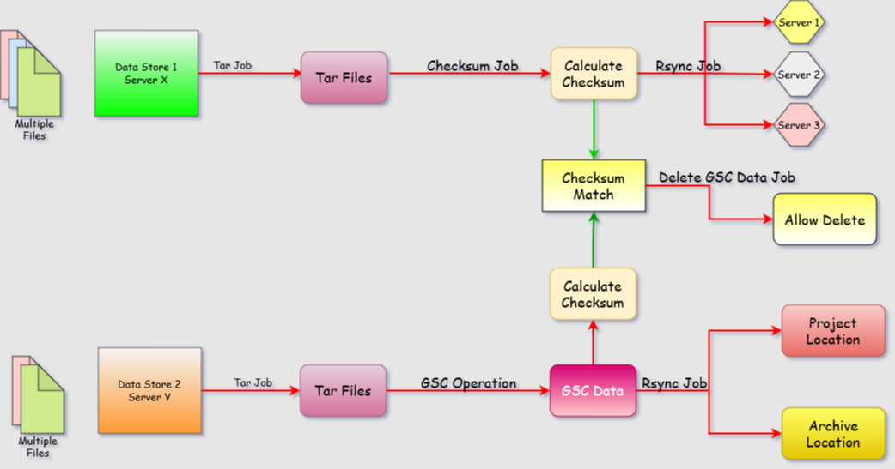

# OOD BioInformatics WorkFlow App
Leveraging OpenOnDemand to create bio informatics workflow application 
## Workflow Descrption
Following are the steps of the workflow application: 
- STEP 1 Tar data -- occures on MAXAM (Cluster X)
- STEP 2 Create md5sum and store it -- occures on MAXAM
- STEP 3 rsync's the data to a one or more pickup location -- occures on MAXAM/
- STEP 4 rsync's the data to a data location 
> (can be combined with previous step) 
- STEP 5: rsync's the data to a PI project folder -- occurs on Cluster Y
- STEP 6: rsync's the data to an archival location -- occures on Cluster Y
> (can be combined with previous step) 
> 

Following is the architecture of BioInformatics Workflow: 

 
